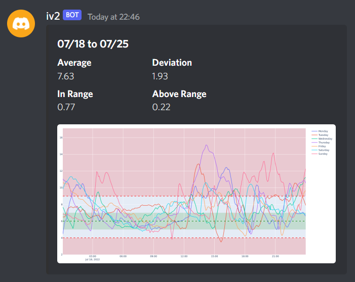

<div align="center">

# iv2

**A personal management tool for type 1 diabetes.**

_Inspired by the likes of [Nightscout](https://github.com/nightscout/cgm-remote-monitor) and [LoopKit](https://github.com/LoopKit/Loop)._

_This project is highly experimental, and should only be used as so._



</div>

---

## Setup

To get started, a configuration file is required with the necessary credentials, see [below](#Testing) on how to generate one.

```console
./scripts/restart.sh
```

## Features

**Note: iv2 currently only supports the Dexcom G6 CGM.**

- Real-time glucose plots with customizable thresholds + insulin and carbs intake display
- Generate weekly and monthly reports on performance metrics such as time spent within range
- Customizable alerts for hyper/hypo-glycemia via Discord

## Why Discord?

- I needed a relatively easy-to-use and customizable cross-platform solution that didn't require writing frontend code
- I decided to build a dashboard-esque experience on top of discord; this means (near) realtime updates and pretty graphs.
- There are some known limitations that I would like to eventually get around to addressing. In no particular order:
  - The real-time plot not updating after edits are made to insulin/carbohydrate intakes. This will be resolved when I figure out an efficient way to cache intermediate results during plotting
  - Discord updates lagging behind CGM updates by a few minutes

## What's Next

Beyond what was suggested in the previous section, there's a few other things I want to accomplish.

- More detailed weekly and monthly reports, compile to PDF format for endocrinologists
- Add documentation on how to bootstrap a new iv2 instance from scratch
- Update tooling on generating prerequisite configurations, libraries, etc.
- Automatic backups
- Add support for `mg/dL` units
- Train new prediction model using LSTM
- Increase code coverage, add more unit tests

## Testing

Includes integration tests that require a running `MongoDB` instance and a Discord bot token.
The following parameters are used by `shuppet` to generate the necessary configuration files.

_The following configuration is not final, and may change drastically in future versions._

```console
go run shuppet/shuppet.go \
  -dexcom-account=$DEXCOM_ACCOUNT \
  -dexcom-password=$DEXCOM_PASSWORD \
  -discord-token=$DISCORD_TOKEN \
  -discord-guild=$DISCORD_GUILD \
  -mongo-username=$MONGO_USERNAME \
  -mongo-password=$MONGO_PASSWORD
```

```console
mv docker-config.yaml config.yaml
./scripts/test.sh
```
